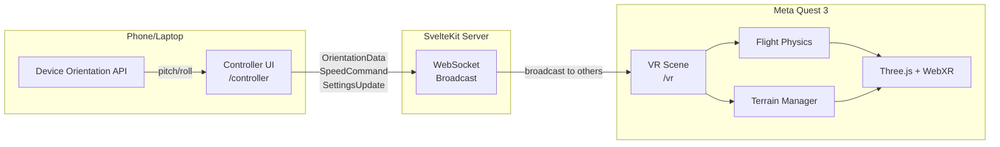
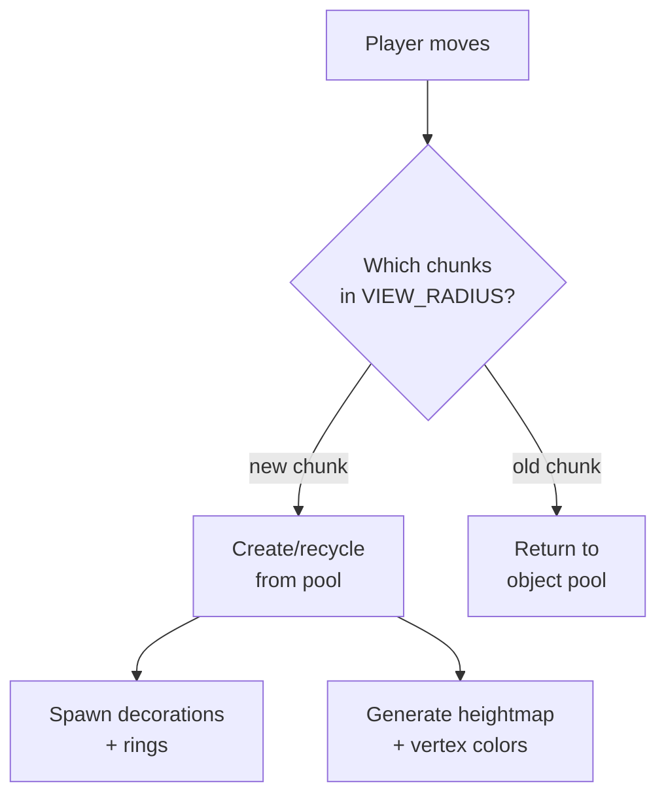

 # 🏗️ Architecture

System design for the ICAROS VR Teaching Platform.

---

## System Overview



## Three Layers

```
┌─────────────────────────────────────────────────┐
│  Experiences (student-built VR worlds)          │
│  Manifest → Catalog → Loader lifecycle          │
├─────────────────────────────────────────────────┤
│  Prototyping Tools                              │
│  Node Editor + Shader Playground                │
├─────────────────────────────────────────────────┤
│  Infrastructure                                 │
│  WebXR, WebSocket, Controllers, SvelteKit       │
└─────────────────────────────────────────────────┘
```

## Data Flow

```
ICAROS Device
    ↓ body lean (pitch + roll)
Phone (Device Orientation API)
    ↓ OrientationData @ 60Hz
Controller UI (/controller)
    ↓ WebSocket (WSS)
SvelteKit Server (hooks.server.ts)
    ↓ broadcast to all except sender
VR Scene (/vr on Quest)
    ↓ Experience.tick()
Three.js Render Loop @ 72fps
```

## Module Architecture

### Routes

| Route | Responsibility |
|-------|---------------|
| `/` | Experience Catalog — select a VR world |
| `/vr` | WebXR canvas, loads active experience, animation loop |
| `/controller` | D-Pad input, speed buttons, 3D preview, settings sidebar |
| `/node-editor` | Visual node editor — modular signal pipeline for VR parameter control |
| `/shader-playground` | Live TSL shader editor with signal-based modules and 3D preview |
| `/test/echoortung` | Laboratory for testing bio-inspired sensing systems |

## `lib/experiences/` — Experience System

Experiences have evolved from single-file scripts to modular ecosystems.

### 1. Standard Pattern (Template)
For simple worlds, use the 5-file contract:
- `manifest.ts`: Declarative I/O (parameters, scene config)
- `scene.ts`: 3D objects + animation (setup, tick, dispose)
- `player.ts`: Orientation → movement mapping
- `settings.ts`: Runtime parameter application
- `index.ts`: Entry point

### 2. Modular Pattern (Advanced)
Large-scale worlds (like `underwater-world v2`) use a **Domain-Driven Design** folder structure:
- `Biome/`: Procedural environments with biological / architectural fidelity
  - `Biome/Sand/`: Dune sand patches (instanced), 70×70 plane with FBM displacement
  - `Biome/Städte/`: Procedural city variants (4 archetypes: `altstadt`/`zentrum`/`vorort`/`kolonie`)
  - `Biome/Korallenriff/`: Procedural + model-loaded coral reefs
- `Objekte/`: Autonomous entities
  - `Objekte/Fische/`: 3 fish schools (boids + scatter + migrate), InstancedMesh
  - `Objekte/Seegras/`: Seagrass meadows (220 blades per patch, TODO: InstancedMesh)
  - `Objekte/Quallen/`: Jellyfish swarm
  - `Objekte/Haie/` / `Objekte/Delfine/`: Reserved for future work
- `Sinne/`: Sensory systems (VR navigation aids)
  - `Sinne/Echoortung/`: Sonar rings (40-pool, raycast detection, 3s lifetime)
  - `Sinne/Leitsystem/`: City-guidance paths (allocation-free per-frame CatmullRom tube)
- `welt/`: Terrain + environment
  - `welt/terrain.ts`: FBM heightmap + biomes
  - `welt/chunks.ts`: 3×3 chunked terrain (400m each), coral slot-tracking
  - `welt/wasser.ts`: Water surface (sine wave in JS, TODO: ShaderMaterial)

This "Senses" (Sinne) architecture allows developers to "borrow" biological abilities for VR navigation.

### `underwater-world v2` — City Variants

`Biome/Städte/city.ts` is a single file that produces 4 architecturally distinct city archetypes from one `CONFIG` lookup + 4 dedicated landmark builders. Cities are **fully procedural at runtime** (no .glb / .gltf for the canonical look) — the only model is `la_night_city.glb` which is used as an optional fallback that was removed in favor of the procedural path.

| Variant | ID | Density | Height | Roof | Landmark | Material | Window Color |
|---------|----|---------|--------|------|----------|----------|--------------|
| Altstadt (old town) | `altstadt` | 110 houses, tight | 6–22m (×4-storey) | flat | Church w/ bell tower + spire + cross | Sandstone pastel, roughness 0.95, metalness 0 | warm yellow `#ffcc44` |
| Zentrum (CBD) | `zentrum` | 55 towers, cluster | 50–130m (skyscrapers) | flat | Glass supertall w/ antenna + warning light | Steel/glass, roughness 0.25, metalness 0.7 | cool blue `#aaccff` |
| Vorort (suburb) | `vorort` | 55 cottages, spread | 3.5–8m | pitched (cone) | Village square w/ well + trees | Warm pastel, roughness 0.85, metalness 0 | warm white `#ffee99` |
| Kolonie (underwater habitat) | `kolonie` | 0 (skips InstancedMesh) | 0–30m | dome | Habitat colony (Conshelf / Tektite / Aquarius / SeaOrbiter / Rougerie inspired) | Off-white bioplastic, roughness 0.35, metalness 0.25 | cyan porthole `#66ddff` |

All variants share:
- Same geodesic dome (radius 65m, `MeshStandardMaterial`, no clearcoat)
- Same glow halo (110m back-side additive sphere)
- Same point light (modulated per variant color)
- InstancedMesh for buildings (1 draw call) when present
- Merged window quads in a single mesh per city

**Construction pipeline** (`createCity(variant)`):
1. `poissonOnRing()` — layout-aware position generator (`tight`/`cluster`/`spread`/`ring` bias)
2. `InstancedMesh` placement with per-instance matrix + color
3. Vorort: `InstancedMesh` pitched roofs (cone geometry)
4. Merged window quads via `mergeGeometries()`
5. `createChurch` / `createSkyscraperAnchor` / `createVillageSquare` / `createHabitatColony` landmark builder

**Habitat Colony** (`createHabitatColony()`) is a fully bespoke multi-component assembly (no InstancedMesh — every part is unique):
- Main hull: 32m horizontal cylinder + hemisphere caps + transparent observation dome
- 6 satellite pods in a ring at radius 22m (each w/ dome caps + 3 cyan portholes)
- 6 thin connecting tunnels (radial, oriented via `tunnel.rotation.y = -a`)
- 4 anchor pylons into the seabed (with foot pads)
- 12m sensor mast + half-sphere radar dish + red beacon
- 5 gunmetal torus trim rings on the main hull
- 11 emissive cyan porthole spheres in 2 rows
- 1 umbilical cable to the floor

**Test page** (`/test/staedte`):
- Independent SvelteKit route (no VR, no WebSocket) with its own WebGLRenderer
- 4 buttons (one per variant), each rebuilds the city in-place via `disposeCity() → createCity()`
- Camera fixed at (0, 45, 110), FOV 50 — chosen so all 4 variants fit comfortably

**Runtime usage** (`underwater-world v2`):
- Start city: random pick of `altstadt` or `vorort` at spiral-found sand (100-180m from spawn, +2m Y-offset)
- Sand-entry cities: same random pick per loaded patch
- The 154MB `la_night_city.glb` model is no longer used in the canonical experience (was a one-off model-swap test)

### Registry
- **Catalog** registers all experiences via `catalog.ts`.
- **Loader** manages lifecycle: load → tick → dispose.

## `lib/three/` — Shared 3D Building Blocks

```
scene.ts ───────── Scene factory (lights, fog)
player.ts ──────── FlightPlayer (rig + camera + arcade physics)
postfx-pipeline.ts  WebXR-compatible EffectComposer (Bloom, Grain, DOF)
sky.ts ─────────── Low-poly sky dome
starfield.ts ───── Instanced star system with flickering
clouds.ts ──────── Procedural cloud groups
rings.ts ───────── Per-chunk collectible rings
loader.ts ──────── GLTF loader wrapper

terrain/
├── manager.ts ──── Chunk load/unload + object pooling
├── chunk.ts ────── Single 128×128 terrain tile
├── geometry.ts ─── Heightmap → BufferGeometry
├── heightmap.ts ── Simplex noise FBM (5 octaves)
└── water.ts ────── Flat water plane

procedural/
├── city.ts ────── InstancedMesh building grid
└── blob-terrain.ts CPU-side FBM displaced plane
```

### `lib/ws/` — WebSocket

```
client.svelte.ts ── Reactive client (Svelte 5 $state, auto-reconnect)
server.ts ───────── Broadcast-to-others handler
protocol.ts ─────── Serialization + type guard validation
```

### `lib/config/` — Config-Driven Design

All tuning values live in `flight.ts` — a single file with `as const` objects. Modules import what they need, never hardcode values.

**Runtime config**: A mutable copy of defaults can be changed live via `SettingsUpdate` WebSocket messages from the controller sidebar. This enables real-time tuning without code changes.

### `lib/node-editor/` — Visual Node Editor

Modular signal system (Eurorack architecture). See [`src/lib/node-editor/README.md`](../src/lib/node-editor/README.md) for full details.

```
components/   Atomic signal processors (12 Logic + 11 UI)
nodes/        Node compositions (9 standard + 8 auto-generated output)
canvas/       SvelteFlow infrastructure (EditorCanvas, NodeShell, Catalog)
controls/     UI primitives (bits-ui based, signal-unaware)
graph/        Headless compute engine (SignalGraph, evaluate)
parameters/   VR parameter registry (dynamic from manifest)
bridge.ts     WebSocket → Three.js (numbers only)
```

### `lib/shader-playground/` — Shader Playground

Signal-based TSL shader editor with 3D preview. See [`src/lib/shader-playground/README.md`](../src/lib/shader-playground/README.md) for full details.

```
modules/      24 shader modules (4 control + 10 vertex + 10 fragment)
components/   Rack UI, Preview, CodeView
engine/       TSL renderer + Three.js integration
codegen.ts    Module chain → TSL node composition
state.svelte.ts  Reactive state (Svelte 5 Runes)
```

Pipeline: `Module[] → codegen → TSL nodes → renderer → 3D Preview`

### `lib/components/` — Svelte UI

```
ControlPad.svelte ──────── D-Pad for pitch/roll
SpeedButtons.svelte ────── Accelerate/Brake
IcarosPreview.svelte ───── 3D model preview (reactive to input)
SettingsSidebar.svelte ─── Runtime config sliders/switches
PageHeader.svelte ──────── Page title + subtitle
LinkCard.svelte ────────── Navigation card with icon
DataTable.svelte ───────── Key-value data display
ArchitectureDiagram.svelte  ASCII architecture diagram
NodeEditorPreview.svelte ── Node editor preview card
```

## Terrain Chunk System



- **Chunk size**: 128×128 units, 32 segments (visible facets)
- **View radius**: 2 chunks in each direction
- **Object pool**: max 30 recycled chunks (prevents GC pressure)
- **Seeded random**: chunk coordinates → deterministic placement
- **Per-chunk data**: terrain mesh + InstancedMesh trees/rocks + torus rings

## WebSocket Protocol

```typescript
// Controller → VR (60Hz)
{ type: "orientation", pitch: number, roll: number, timestamp: number }

// Controller → VR (on press/release)
{ type: "speed", action: "accelerate" | "brake", active: boolean, timestamp: number }

// Controller → VR (settings change)
{ type: "settings", settings: Record<string, number | boolean | string>, timestamp: number }
```

Server broadcasts each message to all connected clients except the sender.

## Performance Budget (Quest 72fps)

| Metric | Budget | Current |
|--------|--------|---------|
| Draw calls | < 100 | ~8 |
| Triangles | < 500k | ~200k |
| JS frame time | < 11ms | ~4ms |
| VRAM | < 256MB | ~40MB |

### Optimizations (cumulative)

- **InstancedMesh** for trees + rocks (2 draw calls per chunk)
- **Chunked terrain** with load/unload based on distance
- **Object pooling** for chunk recycling
- **Frustum culling** (Three.js default)
- **Fog** hides far terrain (100–500 range)
- **FlatShading** reduces normal computation

### Per-Frame Allocation Discipline (applied to `underwater-world v2` hot paths)

Three changes that eliminate per-frame GC pressure on Quest 72fps:

| File | What was allocated each frame | How it's done now |
|------|--------------------------------|---------------------|
| `Sinne/Leitsystem/guidance.ts` | `TubeGeometry`, `BufferGeometry`, `BufferAttribute`, `THREE.Color`, `.map(.clone)` of control points | Float32Arrays pre-allocated in setup; positions/colors mutated in place; `position.needsUpdate = true` once per frame; parallel-transport frame into scratch `_pt`/`_tan`/`_normal`/`_binormal` vectors; pulse colors filled into existing array, no new `THREE.Color` |
| `scene.ts` echo-pulse loop | ~10× `new THREE.Color(0xffff00)` / `new THREE.Color(0x00e5ff)` / `new THREE.Color(0x224466)` | 7 shared `THREE.Color` instances on state (`_flashColor`, `_fishBaseColor`, `_domeAltstadtColor`, `_domeZentrumColor`, `_domeVorortColor`, `_domeModelCityColor`, `_coralIdleColor`); `mat.emissive.copy(sharedColor)` |
| `Biome/Städte/city.ts` + `Biome/Städte/modelCity.ts` dome | `MeshPhysicalMaterial` with `clearcoat: 0.6–0.8` (extra BRDF layer per fragment on a large doubleside transparent dome) | `MeshStandardMaterial` — no clearcoat; visually nearly identical; one fewer full PBR evaluation per fragment |

Shared scratch objects in `city.ts` (`_dummy` `Object3D`, `_scratchCol` `Color`) are reused across all city creations.

## AI-Assisted Development

This project utilizes specialized **AI Agents** for complex feature implementation.
- `AGENTS.md`: Context guide for LLMs.
- `AGENTS_PLAN.md`: Strategic roadmap for autonomous tasks.
- `.agents/skills/`: Domain-specific recipes for level creation.
